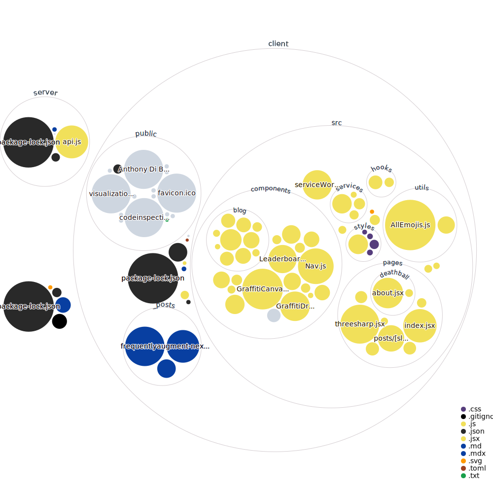

# dibiagg.io

All of the code related to **[dibiagg.io]**, my personal website. The exception is my web-based **[Deathball clone]**, which links from my site but has its own repository. I am always looking to refactor and improve my code so let me know if you have any ideas or find any issues!

[Deathball clone]: https://github.com/anthonydibi/deathball-clone
[dibiagg.io]: https://dibiagg.io
  
## Project Structure
```
dibiagg.io
├── client | Front end
│   ├── _posts | Markdown blog post content
│   ├── public | Static assets (images, PDF)
│   └── src
│       ├── components | Reusable React components
│       ├── hooks | Custom React hooks
│       ├── pages | Routing
│       ├── services | APIs/interfaces
│       └── styles | CSS/Theming
├── README.md
└── server | Backend
    └── api.js | Sets up Express server for Deathball, Graffiti
```

## Codebase Visualization
courtesy of [repo-visualizer](https://github.com/githubocto/repo-visualizer)

