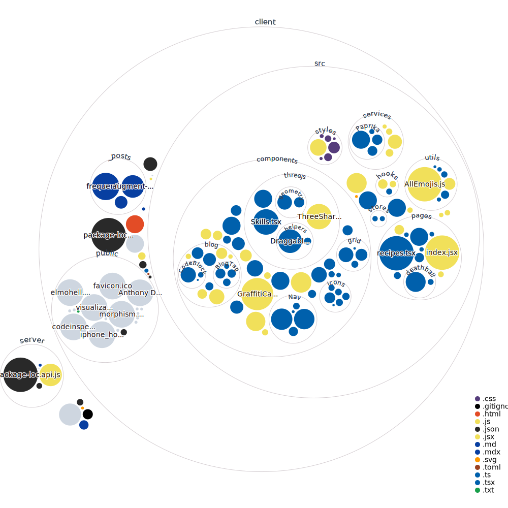

# dibiagg.io

This is a repository which holds all of the code related to **[dibiagg.io]**, my personal website. The exception is my web-based **[Deathball clone]**, which links from my site but has its own repository. I am always looking to refactor and improve my code so let me know if you have any ideas or find any issues!

[Deathball clone]: https://github.com/anthonydibi/deathball-clone
[dibiagg.io]: https://dibiagg.io
  
## Project Structure
```
dibiagg.io
├── client | Front end
│   ├── next.config.js | Next.js settings
│   ├── _posts | Blog post content as MDX
│   ├── public | Static assets
│   └── src
│       ├── ColorModeSwitcher.js
│       ├── components | Reusable React components
│       ├── hooks | Custom React hooks
│       ├── pages | Webpage routes
│       ├── reportWebVitals.js
│       ├── services | APIs
│       ├── serviceWorker.js
│       ├── setupTests.js
│       ├── styles | ChakraUI theme and CSS modules
│       └── test-utils.js
├── README.md
└── server | Backend
    └── api.js | Server logic for Deathball, Graffiti - handles database queries/WebSocket comms
```

## Codebase visualization


